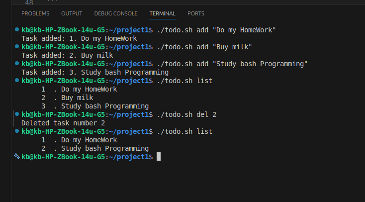

# Terminal To-Do List Application
This is a simple command-line **Terminal to-do List Application** written in Bash.\
It allows you to **add**, **list**, and **delete** tasks stored in text file
`tasks.txt`.
## Features
- Add tasks with automatic numbering\
- List all tasks with line numbers\
- Delete tasks by number\
- Automatically creates `tasks.txt` if it doesn't exist
## Files
**todo.sh** ---The main script\
**tasks.txt** ---stores your tasks
## Usage
### 1. Add a task
``` bash
./todo.sh add "Your task description"
```

### 2. List all tasks

``` bash
./todo.sh list
```

### 3. Delete a task

``` bash
./todo.sh del task_number
```

## Example Output
### screenshot


*This is a screenshot showing how to add, del, and list*

``` bash
$ ./todo.sh add "Do my HomeWork"
Task added: 1. Do my HomeWork

$ ./todo.sh add "Buy Milk"
Task added: 2. Buy Milk

$ ./todo.sh add "Study bash Programming"
Task added: 3. Study bash Programming

$ ./todo.sh list
     1  . Do my HomeWork
     2  . Buy Milk
     3  . Study bash Programming

$ ./todo.sh del 2
Deleted task number 2
```
## Requirements to run the app
- Bash shell\
- Linux or macOS